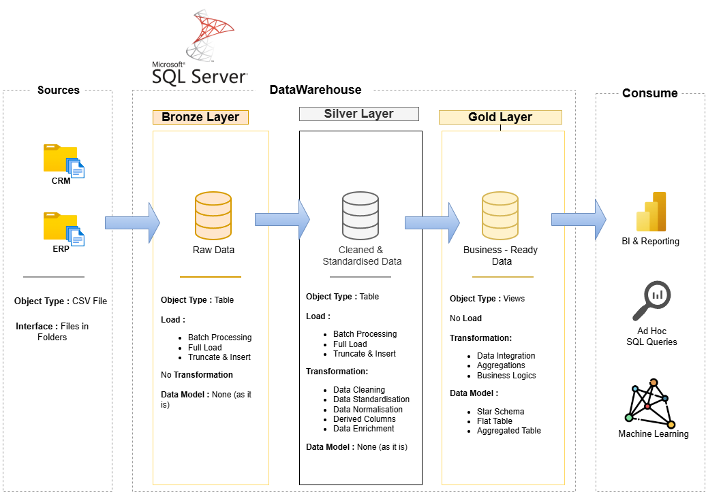

# Data Warehouse and Analytics Project

welcome to the **Data Warehouse and Analytics Project** repository! :rocket:
This project demonstrate a comprehensive data warehousing and analytics solution, from building a data warehouse to generating actionable insights. Designed as a portfolio project highlights industry best practices in data engineering and analytics.

---
## 📖 Project Overview 
This project involves:
    1. **Data Architecture :** Designing a modern Data Warehouse Using Medallion Architecture **Bronze**, **Silver**, **Gold** layers.
    2. **ETL Pipelines:** Extracting, transforming, and load data from source systems into the warehouse.
    3. **Data Modelling:** Developing fact and dimension tables optimised for analytical queries.
    4. **Analytics & Reporting:** Creating SQL-based reports and dashboardf for actionalble insights.

     🎯 This repository is an excellent resource for professionals and students looking to showcase expertise in:
     - SQL Development
     - Data Architecture
     - Data Engineering
     - ETL Pipeline Developer
     - Data Modelling
     - Data Analytics

---
    
## 🚀 Project Requirements

### Building the Data Warehouse (Data Engineering)

#### Objective
Develop a modern data warehouse using SQL Server to consolidate sales data, enabling analytical reporting and informed decision_making.

#### Specifications
-**Data Sources**: Import data from two source systems (ERP and CRM) provided as CSV files.
-**Data Quality**: Cleanse and resolve data quality issues prior to anlysis.
-**Integration**: Combine both sources into a single, user-friendly data model designed for analytical queries.
-**Scope**: Focus on the latest dataset only; historization of data is not required.
-**Documentation**: Provide clear documentation of the data model to support both business stakeholders and analytics teams.

---

### BI: Analytics & Reporting (Data Analytics)

#### Objective
Develop SQL-based analytics to deliver detailed insights into:
-**Customer Behaviour**
-**Product Performance**
-**Sales Trends** 

These insights empower stakeholders with key business metrics, enabling strategic decision-making.

---
## 🏗️Data Architecture
The data arachitecture for this project follows Medallion Architecture **Bronze**, **Silver**, and **Gold** layer:

    1.**Bronze Lyer:** Stores raw data as it is from the source systems. Data is ingested from CSV Files into SQL Server Database.
    2.**Silver Layer:** This layer includes data cleansing,standardisation, and normalisation processes to prepare data for analysis.
    3. **Gold Layer:** Houses business_ready data modeled into a star schema required for reporting and analytics.

---
## Repository Structure 
    data-warehouse-project/
    │
    ├── datasets/                                 # Raw datesets used for the project (ERP and CRM data)
    │ 
    ├── docs/                                     # Project documentation and architecture details
    │     ├── etl.drawio                          # Drwa.io file shows all different techniques and methods of ETL
    │     ├── data_architecture.png               # Draw.io file shows the project's architecture
    │     ├── data_catalog.md                     # Catalog of datasets, including field description and metadata
    │     ├── data_flow.drawio                    # Draw.io file for the data flow diagram
    │     ├── data_models.drawio                  # Draw.io file for data models (star schema)
    │     ├── naming-conventions.md               # Consistent naming guidelines for tables, columns, and files
    │
    ├── scripts/                                  # SQL scripts for ETL and transformations
    │     ├── bronze/                             # Scripts for extracting and loading raw data
    │     ├── silver/                             # Scripts for cleaning and transforming data
    │     ├── gold/                               # Scripts for creating analytical models
    │
    ├── tests/                                    # Test scripts and quality files
    │
    ├── README.md                                 # Project overview and instructions
    ├── LICENSE                                   # License information for the repository
    ├── .gitignore                                # Files abd directories to be ignored by Git
    └── requirements.txt                          # Dpendencies and requirements for the project

## :shield: License

This project is licensed under the [MIT License].(LICENSE). You are free to use, modify, and share this project with proper attribution.

## 🌟About Me

Hello! I'm Yashasvi Gupta, an aspiring Data Analyst currently learning SQL, Excel, Python, and data visualisation tools.
This project was built by learning alongside the Data with Baraa Youtube Tutorial as part of my practical learning journey in Data Analytics and Data Warehousing.

## 💻Learning Source:
Data with Baraa Youtube Channel 📚

